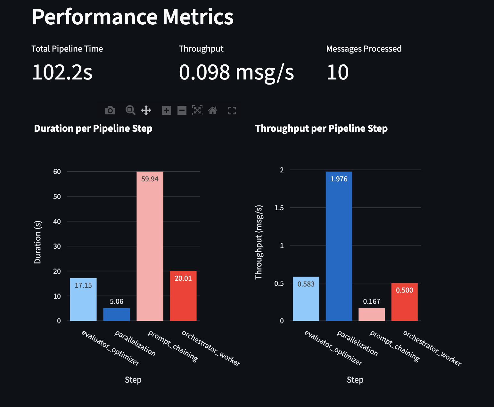
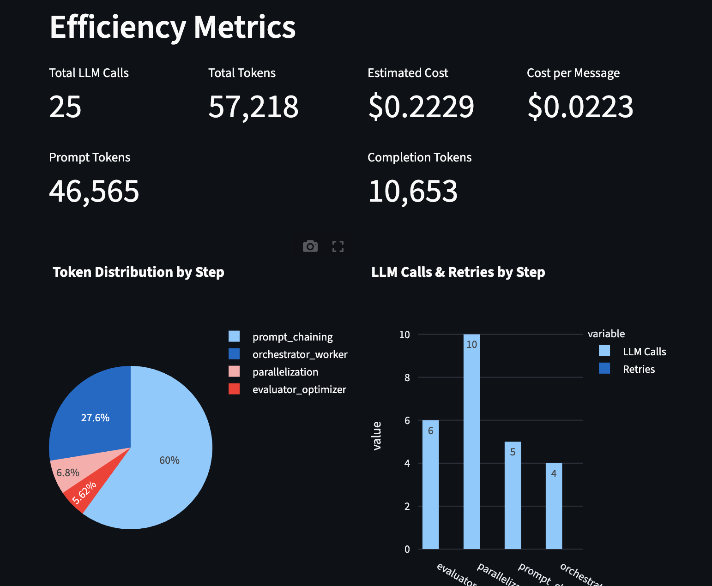
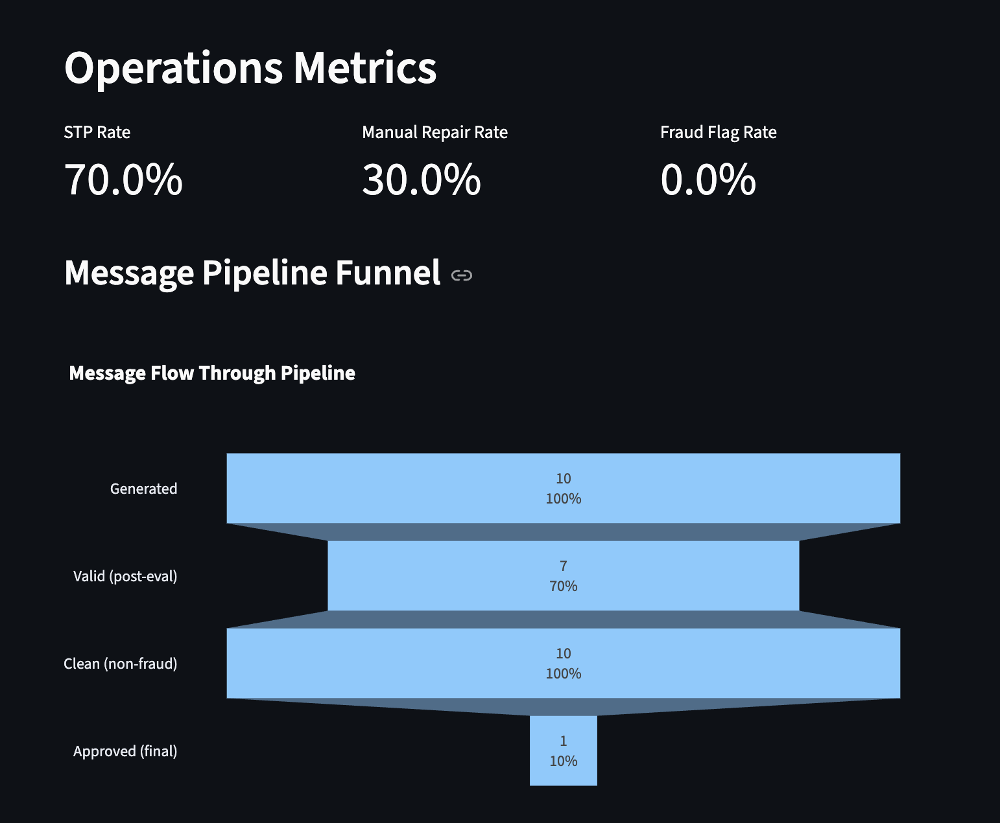

# Agentic SWIFT Processing System

An AI-powered pipeline for processing, validating, and fraud-screening international bank payment messages (SWIFT MT103/MT202) using multi-agent patterns.

---

## Overview

This system simulates how a bank could use AI agents to automatically validate, detect fraud, and make compliance decisions on international wire transfers — replacing what would normally require multiple human analysts.

All LLM calls use **OpenAI GPT-4o**.

---

## Project Structure

```
project/
├── agents/
│   ├── evaluator_optimizer.py      # Step 1: Validate & correct messages
│   ├── parallelization.py          # Step 2: Parallel fraud detection
│   ├── prompt_chaining.py          # Step 3: Chain of compliance agents
│   ├── orchestrator_worker.py      # Step 4: Orchestrator-worker pattern
│   └── workflow_agents/
│       └── base_agents.py          # BaseAgent ABC + all fraud agent classes
├── audits/
│   ├── explainability.jsonl        # Per-message audit log (one record per message)
│   └── metrics.jsonl               # Pipeline metrics (one record per run)
├── models/
│   ├── bank.py                     # Bank entity model
│   └── swift_message.py            # SWIFT message Pydantic model
├── services/
│   ├── explainability_logger.py    # Explainability audit logger
│   ├── llm_service.py              # OpenAI integration service
│   ├── metrics_collector.py        # Performance, efficiency & ops metrics
│   └── swift_generator.py          # Fake SWIFT message generator
├── config.py                       # System configuration
├── dashboard.py                    # Streamlit metrics dashboard
├── main.py                         # Entry point — runs the full pipeline
└── generate_swift_messages.py      # Standalone message generator script
```

---

## Pipeline (4 Steps)

### Step 1 — Evaluator-Optimizer
- Generates SWIFT messages and validates them against SWIFT standards (BIC format, amount range, currency, reference length)
- If invalid, sends the message to GPT-4o (`SwiftCorrectionAgent`) to auto-correct errors
- Iterates up to 3 times until valid or marks as `INVALID`

### Step 2 — Parallelization (Fraud Detection)
Runs 4 fraud detection agents **simultaneously** on every message:

| Agent | What it checks |
|---|---|
| `FraudAmountDetectionAgent` | Large or suspiciously round amounts |
| `FraudPatternDetectionAgent` | BIC test patterns, suspicious keywords |
| `GeographicRiskAgent` | High/medium-risk country codes in BIC |
| `AnomalyDetectionAgent` | LLM-based (GPT-4o) detection of subtle anomalies |

The first three agents are rule-based; the `AnomalyDetectionAgent` uses GPT-4o to catch subtle anomalies that rules might miss (unusual field combinations, naming conventions, timing patterns). Results are aggregated by `FraudAggAgent` (threshold: 50% avg risk score) and each message is marked `FRAUDULENT` or `CLEAN`.

### Step 3 — Prompt Chaining
Passes messages through a chain of 5 AI agents in sequence, each building on the previous:

1. **InitialScreener** — Assigns GREEN / YELLOW / RED risk level
2. **TechnicalAnalyst** — Validates SWIFT format, BIC codes, reference patterns
3. **RiskAssessor** — Evaluates behavioral patterns and velocity
4. **ComplianceOfficer** — AML, sanctions, KYC, and regulatory checks
5. **FinalReviewer** — Makes final decision: `APPROVE`, `HOLD`, or `REJECT`

### Step 4 — Orchestrator-Worker
- An **Orchestrator** LLM analyzes the message batch and dynamically creates specific tasks
- **GenericAgent** workers execute each task (compliance checks, fraud investigations, summaries)
- Filters to high-value transactions (amount > $50,000) for this step

---

## Metrics Dashboard

The system includes a Streamlit dashboard that tracks **performance**, **efficiency**, and **operational** metrics across pipeline runs. Metrics are automatically collected during each run and persisted to `audits/metrics.jsonl`.

```bash
streamlit run dashboard.py
```

### Performance Metrics

Tracks total pipeline time, per-step duration, and throughput (messages/second).



### Efficiency Metrics

Tracks LLM API usage: total calls, token consumption (prompt vs. completion), estimated cost per message, retries, and cost breakdown by pipeline step.



### Operations Metrics

Tracks straight-through processing (STP) rate, manual repair rate, fraud flag rate, and a message pipeline funnel showing how messages flow from generation through to final approval.



### Projected Metrics at Scale (Millions of Messages)

The dashboard currently shows results from a 10-message demo batch. At production scale with millions of SWIFT messages, we would expect the following shifts:

| Metric | Current (10 msgs) | Projected (1M+ msgs) | Notes |
|---|---|---|---|
| **Total Pipeline Time** | ~102s | Hours to days | Dominated by LLM latency; would require batched async calls, queue-based architecture, and horizontal scaling |
| **Throughput** | 0.098 msg/s | 50-200 msg/s | Achievable with async parallelism, batch API endpoints, request pooling, and multiple API keys |
| **STP Rate** | 70% | 92-97% | With model fine-tuning on real SWIFT data and refined validation rules, far fewer messages would need correction cycles |
| **Manual Repair Rate** | 30% | 3-8% | Optimizer accuracy improves with domain-specific training data; only edge cases require human review |
| **Fraud Flag Rate** | 0-10% | 1-3% | Real-world SWIFT fraud rates are low; rule-based agents would be calibrated against historical data to reduce false positives |
| **Total LLM Calls** | 25 | 2.5M+ | Linear scaling per message; cost optimization would require routing low-risk messages to cheaper models (GPT-4o-mini) and reserving GPT-4o for flagged transactions |
| **Cost per Message** | $0.022 | $0.005-0.01 | Prompt caching, shorter prompts, model tiering (mini for screening, full for review), and batch API discounts would cut per-message cost by 50-75% |
| **Estimated Total Cost** | $0.22 | $5,000-10,000 per 1M msgs | At scale, the prompt chaining step (60% of tokens) would be the primary optimization target — condensing chain context and using structured outputs |
| **Retries** | 0 | 1-5% of calls | Rate limiting becomes significant; exponential backoff, request queuing, and multiple API key rotation would keep retry rates manageable |
| **Approved (Final)** | 10% | 85-92% | Most legitimate SWIFT traffic is routine; the current low approval rate reflects the conservative nature of the AI agents on synthetic data with no historical baseline |

**Key architectural changes needed for scale:**
- **Async pipeline** — Replace synchronous LLM calls with async batched processing
- **Model tiering** — Use GPT-4o-mini for initial screening and rule-based steps; escalate to GPT-4o only for flagged messages
- **Prompt optimization** — Compress chain context to reduce the 60% token share consumed by prompt chaining
- **Streaming & queues** — Message queue (e.g., Kafka/SQS) between pipeline steps for backpressure handling
- **Caching** — Cache LLM responses for repeated patterns (e.g., same BIC pair risk assessments)
- **Database backend** — Replace JSONL files with a time-series database for metrics and a document store for audit logs

---

## Explainability Logging

Every run produces a structured audit trail in `audits/explainability.jsonl`. Each line is one JSON record representing the full processing history of a single message across all pipeline steps:

```json
{
  "run_id": "...",
  "message_id": "...",
  "timestamp": "...",
  "steps": {
    "evaluator_optimizer":  { "agent": "...", "decision": "VALID",   "output": {...} },
    "parallelization":      { "agent": "...", "decision": "CLEAN",   "output": {...} },
    "prompt_chaining": {
      "initial_screening":  { "agent": "InitialScreener",   "decision": "GREEN",   "output": {...} },
      "technical_analysis": { "agent": "TechnicalAnalyst",  "decision": "maintain","output": {...} },
      "risk_assessment":    { "agent": "RiskAssessor",      "decision": "batch-level", "output": {...} },
      "compliance_review":  { "agent": "ComplianceOfficer", "decision": "low",     "output": {...} },
      "final_review":       { "agent": "FinalReviewer",     "decision": "APPROVE", "output": {...} }
    }
  }
}
```

---

## Setup

### Prerequisites
- Python 3.11+
- OpenAI API key

### Install dependencies
```bash
pip install faker numpy openai pandas pydantic scipy streamlit plotly
```

### Configure environment
Create a `.env` file in the project root:
```
OPENAI_API_KEY=your-api-key-here
```

### Run the pipeline
```bash
export $(grep -v '^#' .env | xargs) && python main.py
```

### Launch the metrics dashboard
```bash
streamlit run dashboard.py
```

---

## Configuration

Edit `config.py` to change system behaviour:

| Setting | Default | Description |
|---|---|---|
| `MESSAGE_COUNT` | `10` | Number of SWIFT messages to generate |
| `BANK_COUNT` | `5` | Number of banks in the registry |
| `MAX_WORKERS` | `8` | Max parallel threads for fraud detection |
| `OPENAI_MODEL` | `gpt-4o` | LLM model used for all AI calls |
